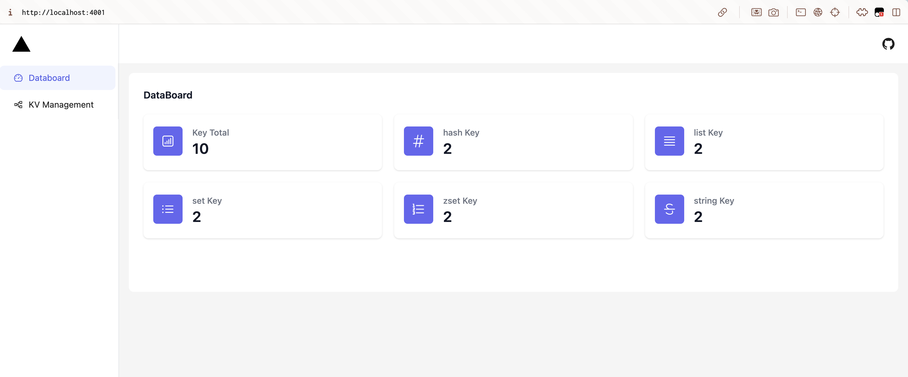
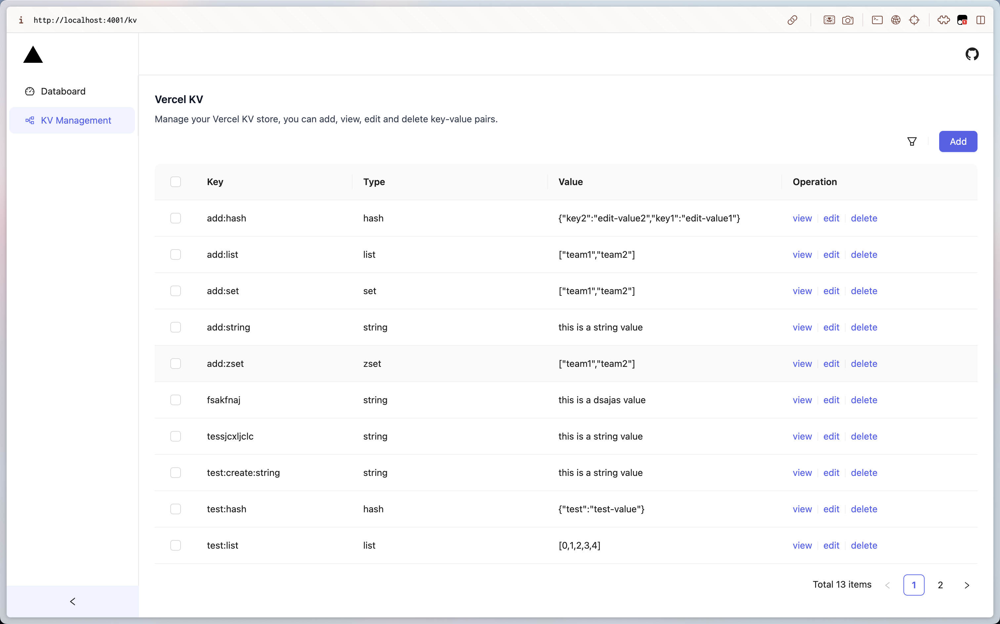
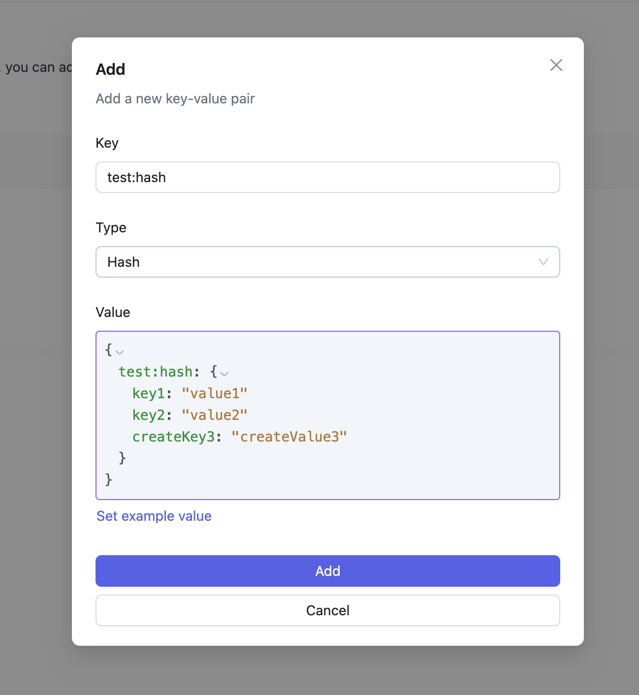
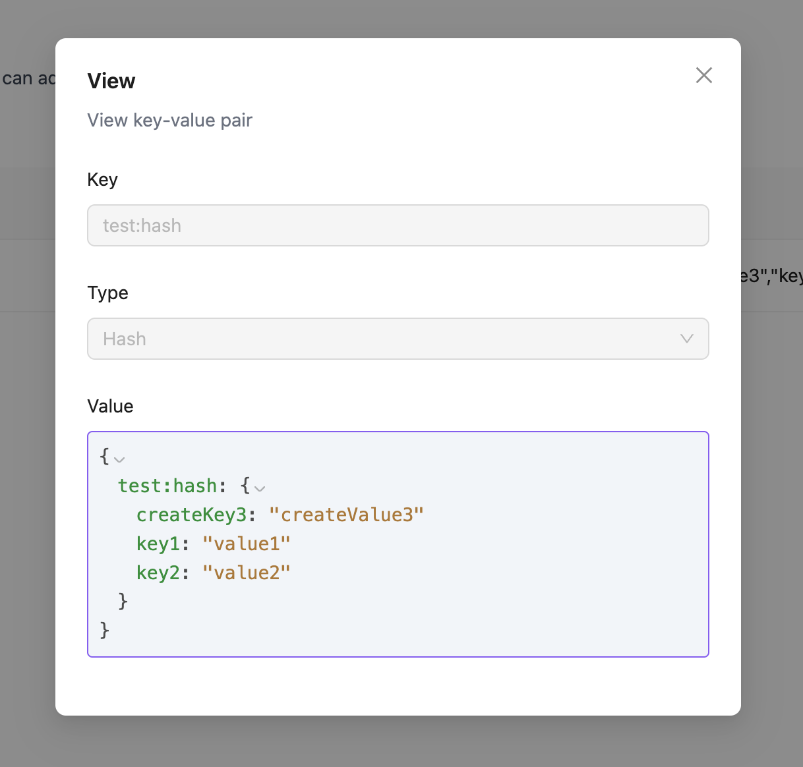
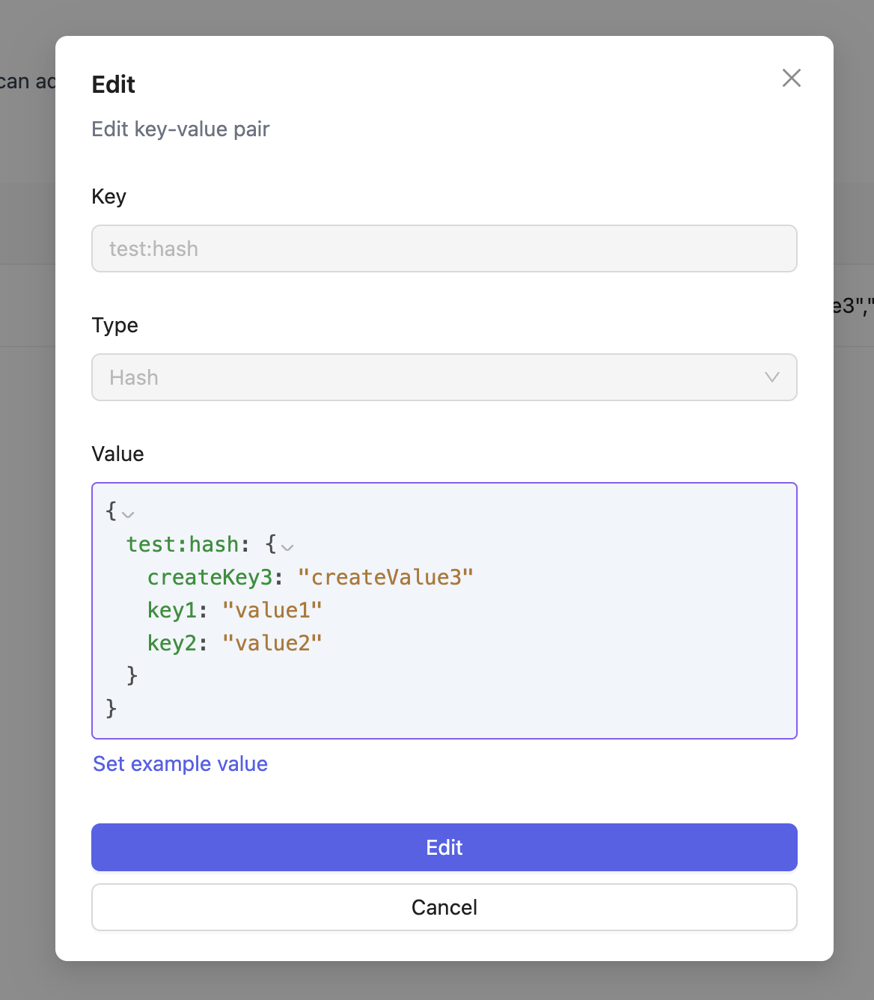

# What is it?

It is a visualization of Vercel KV store. It is a simple project that allows you to see the contents of your Vercel KV store.

# What does it do?

It allows you to see the contents of your Vercel KV store. You can see the keys and values of your KV store. You can also delete keys from your KV store. 

# How does it work?

It uses the Vercel KV SDK to get the contents of your KV store.

# How do I use it?

1. Clone the repository
2. Run `npm install`
3. from https://vercel.com/your-team's/~/stores copy `.env.local` content to `.env.development.local`
4. Run `npm run dev`

# Renderings

